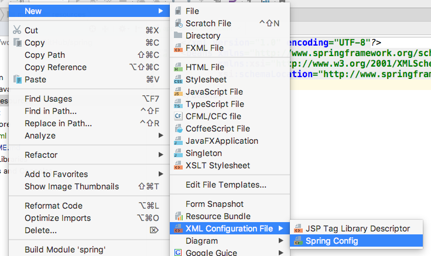

# spring

## 1.基础

### 1.1. 创建spring工程

​        创建Maven项目，加入如下依赖

```xml
<dependency>
    <groupId>org.springframework</groupId>
    <artifactId>spring-context</artifactId>
    <version>5.0.7.RELEASE</version>
</dependency>
```

### 1.2. 创建spring配置文件

<font id="1"/>

 

初始文件内容如下：

```xml
<?xml version="1.0" encoding="UTF-8"?>
<beans xmlns="http://www.springframework.org/schema/beans"
       xmlns:xsi="http://www.w3.org/2001/XMLSchema-instance"
       xsi:schemaLocation="http://www.springframework.org/schema/beans http://www.springframework.org/schema/beans/spring-beans.xsd">

</beans>
```

## 2. HelloWorld

### 2.1. 创建1个类

```java
@Data
public class Hello {
    private String str;

    public void say(){
        System.out.println("hello " + str);
    }
}
```

### 2.2. spring配置文件

> 在类路径下创建1个spring配置文件，参见[创建spring配置文件](#1.2. 创建spring配置文件)，内容如下

```xml
<bean id="hello" class="com.shuyan.Hello">
    <property name="str" value="spring"/>
</bean>
```

### 2.3. 调用

```java
public static void main( String[] args )
{
    // 从类路径下查找名为 “applicationContext.xml” 的spring配置文件，并获取 ApplicationContext 对象
    ApplicationContext ctx = new ClassPathXmlApplicationContext("applicationContext.xml");
    // 通过 ApplicationContext 对象获取 applicationContext.xml 中配置的id为“hello”的bean的class属性配置的类的1个实例
    Hello hello = (Hello)ctx.getBean("hello");
    hello.say();
}
```

## 	3. IOC&DI

> IOC就是反转资源获取的方向
>
> DI就是组件以预先约定好的方式（如setter）介绍来自容器的资源注入

### 3.1. IOC容器

> 加载spring配置文件之后，得到1个IOC容器对象，在该spring配置文件中配置的bean都可以通过该对象获取他的1个实例

#### 3.1.1. spring提供了2种IOC容器

> 以下两个IOC容器都是接口

1. `ApplicationContext`

   提供了很多更高级的特性，是`BeanFactory`的子接口，面向spring开发者，几乎所有场合都使用`ApplicationContext`

2. `BeanFactory`

   IOC容器的基本实现，面向spring本身

#### 3.1.2. `ClassPathXmlApplicationContext`

> 该类是`ApplicationContext接口的1个实现类，用于从类路径下加载spring配置文件并获取IOC容器对象

#### 3.1.3. 从IOC容器中获取类的实例

> 获取实例通过`ApplicationContext`接口的`getBean`方法获取
>
> `ApplicationContext`提供了5种`getBean`的重载方法

- 通过Id获取bean实例

  ```java
  /**
  * 参数：spring配置文件中bean的id
  */
  object getBean(String name);
  ```

  例：

  ```java
  Hello hello = (Hello)ctx.getBean("hello");
  ```

- 通过类的类型获取bean实例

  ```java
  T getBean(Class<T> requiredType);
  ```

  例：

  ```java
  Hello bean = ctx.getBean(Hello.class);
  ```

## 4. 配置Bean

> 配置Bean就是将某个类交给spring管理的过程

### 4.1.  基于xml配置

#### 4.1.1. 配置bean

> 基于xml配置bean时，就是在spring的配置文件中使用bean标签将1个类交给spring管理

```Xml
<bean id="hello" class="com.shuyan.Hello">
    <property name="str" value="spring"/>
</bean>
```

+ bean标签：用于将某个类交给spring管理
  + id：为这个被管理的类起1个Id，同一个文件中该id必须唯一，通过该ID即可获取到这个类的实例
  + class：被管理类的全类名
+ property标签：用于向返回的实例中设置属性值
  + name：类中属性名
  + value：要注入的值

#### 4.1.2. 依赖注入

##### 4.1.2.1. 属性注入

> + 属性注入就是使用set方法对实例中的属性进行注入
> + 要求：
>   + 被管理类中需要依赖注入的属性提供set方法
>   + 提供无参构造器
>   + spring配置文件的bean中使用`<property/>`标签配置要为哪个属性植入什么值

##### 4.1.2.2. 构造器注入

> - 属性注入就是使用被管理类的构造方法对实例中的属性进行注入
> - 要求：
>   - 被管理类中需要依赖注入的属性作为参数提供构造方法
>   - spring配置文件的bean中使用`<constructor-arg/>`标签配置要为构造方法中第几个参数注入什么值

+ 被管理类

  > 提供参数包含要注入的属性的构造方法

  ```java
  public class Car {
      private String name;
      private int price;
      private int age;
  
      public Car(String name, int price, int age) {
          this.name = name;
          this.price = price;
          this.age = age;
      }
  
      @Override
      public String toString() {
          return "Car{" +
                  "name='" + name + '\'' +
                  ", price=" + price +
                  ", age=" + age +
                  '}';
      }
  }
  ```

+ 配置Bean

  ```Xml
  <bean id="car" class="com.shuyan.Car">
      <constructor-arg value="BYD"/>
      <constructor-arg value="100000"/>
      <constructor-arg value="10"/>
  </bean>
  ```

  + `<constructor-arg/>`标签用于构造器注入，默认配置顺序就是参数的顺序

    + value：要注入的值
    + index：用于指定注入到第几个参数
    + type：指定要匹配的参数的类型，类型不一致时则不匹配这个构造器

  + 例

    ```xml
    <constructor-arg value="BYD" index="0" type="java.lang.String"/>
    ```

##### 4.1.2.3 注入简单类型

> 有2种方式注入简单类型数据：
>
> + 通过value标签属性设置属性值
> + 通过value子标签设置属性值

区别：

> 无论`属性注入`还是`构造器注入`，使用`value`标签属性向实例中注入属性值时，要求值不能包含特殊字符，如果包含了特殊字符，只能使用`value`子标签进行注入

+ 不包含特殊字符时

  ```xml
  <property name="str" value="spring"/>
  ```

  等效于

  ```xml
  <property name="str">
      <value>spring</value>
  </property>
  ```

+ 包含特殊字符时

  > 不能使用`value`属性设置值，只能使用`value`子标签配和`<![CDATA[]]>`块使用

  ```xml
  <property name="str">
      <value><![CDATA[<spring]]></value>
  </property>
  ```

> `property`和`constructor-arg`都有可以这么用

##### 4.1.2.4. 注入引用类型

###### 4.1.2.4.1. 外部bean方式注入

> 当1个类中的属性的类型是另外一个类时，可以通过`ref`属性或子标签指定，而不再使用`value`属性或子标签

```xml
<bean id="car" class="com.shuyan.Car">
    <constructor-arg index="0" type="java.lang.String">
        <value><![CDATA[<BYD]]></value>
    </constructor-arg>
    <constructor-arg value="100000"/>
    <constructor-arg value="10"/>
</bean>
<bean id="person" class="com.shuyan.Person">
    <property name="name" value="shuyan"/>
    <property name="age" value="26"/>
    <property name="car" ref="car"/>
</bean>
```

> 注入car属性时，使用`ref`属性设置为另外1个bean的id

###### 4.1.2.4.2. 内部bean方式注入

> 当1个类中需要注入的属性的类型还没有交给spring管理时,可以使用内部bean方式注入

```xml
<property name="car">
    <bean class="com.shuyan.Car">
        <constructor-arg value="Ford"/>
        <constructor-arg value="100000"/>
        <constructor-arg value="10"/>
    </bean>
</property>
```

> 内部bean不能在他所属的property标签外部使用

##### 4.1.2.5. 注入null

> 当需要注入null时，使用`<null/>`标签进行注入

```xml
<property name="car"><null/></property>
```

##### 4.1.2.6. 级联属性赋值

```xml
<bean id="person1" class="com.shuyan.Person">
    <property name="name" value="shuyan"/>
    <property name="age" value="26"/>
    <property name="car" ref="car"/>
    <property name="car.name" value="mzd"/>
</bean>
```

> 先给person1注入1个car实例，然后设置car的属性
>
> 要求car的属性必须有set方法

##### 4.1.2.7. 注入集合属性

> spring可以通过`<list/>`、`<map/>`、`<set/>`标签类注入集合属性，在这3个标签下可以使用`<value/>`子标签设置简单类型，`<ref/>`子标签设置引用类型，也可以将内部bean放入集合

1. 注入list集合

   ```xml
   <bean id="person2" class="com.shuyan.Person">
       <property name="name" value="shuyan"/>
       <property name="age" value="26"/>
       <property name="car" ref="car"/>
       <property name="car.name" value="mzd"/>
       <property name="carList">
           <list>
               <ref bean="car"/>
               <bean class="com.shuyan.Car">
                   <constructor-arg value="mzd"/>
                   <constructor-arg value="100000"/>
                   <constructor-arg value="10"/>
               </bean>
           </list>
       </property>
   </bean>
   ```

   > 注入数组和注入list集合完全相同

2. 注入Map集合

   ```xml
   <bean id="person3" class="com.shuyan.Person">
       <property name="name" value="shuyan"/>
       <property name="age" value="26"/>
       <property name="car" ref="car"/>
       <property name="car.name" value="mzd"/>
       <property name="carMap">
           <map>
               <entry key="a" value-ref="car"/>
               <entry key="b">
                   <bean class="com.shuyan.Car">
                       <constructor-arg value="mzd"/>
                       <constructor-arg value="100000"/>
                       <constructor-arg value="10"/>
                   </bean>
               </entry>
           </map>
       </property>
   </bean>
   ```

##### 4.1.2.8. 注入Properties

> 当要注入的属性为Properties的对象时，可以使用`props`和`prop`子标签为`Properties`对象中的属性赋值

```xml
<property name="properties" >
    <props>
        <prop key="user">root</prop>
        <prop key="password">rootroot</prop>
    </props>
</property>
```

##### 4.1.2.9. 抽离公用片段

> + 配置spring过程中，可能会出现相同的配置片段要重复写多次的情况，可以使用`<util:xxxx/>`标签将公用的片段抽离出来
>
> + 使用`<util:xxxx/>`标签需要引入如下命名空间：
>
>   `xmlns:util="http://www.springframework.org/schema/util"`

```xml
<util:list id="carList">
    <ref bean="car"/>
    <bean class="com.shuyan.Car">
        <constructor-arg value="mzd"/>
        <constructor-arg value="100000"/>
        <constructor-arg value="10"/>
    </bean>
</util:list>
<bean id="person4" class="com.shuyan.Person">
    <property name="name" value="shuyan"/>
    <property name="age" value="26"/>
    <property name="car" ref="car"/>
    <property name="car.name" value="mzd"/>
    <property name="carList" ref="carList"></property>
</bean>
```

##### 4.1.2.10. P命名空间

> + 这个P就代表要被实例化的对象本身。通过`P:`可以为对象的属性赋值
>
> + 使用P命名空间需要引入如下命名空间：
>
>   `xmlns:P="http://www.springframework.org/schema/p`

```xml
<bean id="person4" class="com.shuyan.Person">
    <property name="name" value="shuyan"/>
    <property name="age" value="26"/>
    <property name="carList" ref="carList"/>
</bean>
```

使用P命名空间可以这样写：

```xml
<bean id="person5" class="com.shuyan.Person" P:age="25" P:name="cj" P:carList-ref="carList"/>
```

##### 4.1.2.11. 自动装配

> 当注入引用类型属性时，一方面可以使用手动装配的形式，也可是使用自动装配

手动装配：

```xml
<bean id="person5" class="com.shuyan.Person" P:age="25" P:name="cj" P:carList-ref="carList"/>
```

改为自动装配：

```xml
<bean id="person6" class="com.shuyan.Person" P:age="25" P:name="cj" autowire="byName"/>
```

此时，不需要明确指定`carList`指向哪个Bean，spring会自动将对应的Bean装配进来

+ autowire
  + byName：通过名字进行匹配，要求bean的id与类中被注入的属性名完全相同
  + byType：通过类型匹配，当spring管理的bean中有多个该类型的bean时，则自动装配失败

#### 4.1.3. bean配置的继承、抽象、依赖

1. bean的继承

   ```xml
   <bean id="city1" class="com.shuyan.City" P:name="changchun" P:province="jilin"/>
   <bean id="city2" class="com.shuyan.City" P:name="jilin" P:province="jilin"/>
   ```

   > 上面两个bean的`class`和`P:province`属性是完全相同的，只有`id`和`P:name`是不同的，所以可以使用bean的继承只修改需要修改的属性，其他的继承自父bean

   ```xml
   <bean id="city1" class="com.shuyan.City" P:name="changchun" P:province="jilin"/>
   <bean id="city2" parent="city1" P:name="jilin" />
   ```

2. 抽象bean

   > bean可以继承自1个bean实例，也可以继承自一个模板，上面的`city1`就是1个实例，他是可以被实例化的；但是如果不想某个bean被实例化，它只用于被继承，可以设置该bean的`abstract`属性为`true`，将该bean配置为抽象bean

   ```xml
   <bean id="city" class="com.shuyan.City" P:province="jilin" abstract="true"/>
   <bean id="city1" parent="city" P:name="changchun"/>
   <bean id="city2" parent="city" P:name="jilin"/>
   ```

3. 依赖

   > + 当获取1个bean的实例时，要求spring容器内必须已经存在另外几个bean，则可以使用使用`depends-on`标签，依赖另外几个bean
   > + 多个bean之间可以使用逗号或空格分割

   ```xml
   <bean id="person" class="com.shuyan.Person" P:name="shuyan" P:age="26" depends-on="car,city"/>
   ```

#### 4.1.4. bean的作用域

> + bean的作用域指的是，在什么时候，spring返回的是同1个实例
> + bean的作用域通过bean的`scope`属性指定

bean的作用域分为2种：

+ `singleton` 

  单例模式，也是默认值，每次从spring容器中获取的都是同1个实例，该实例在创建IOC容器时创建

+ `prototype`

  原型模式，每次从spring容器中获取的都是1个新的实例，每次获取实例时创建1个实例

#### 4.1.5. bean中使用外部配置文件

> + bean中使用外部配置文件就是：注入实例中的属性值从配置文件中获取
> + 使用该功能需要引入命名空间：`xmlns:context="http://www.springframework.org/schema/context"`

+ 编写配置文件`db.properties`

  ```properties
  city=changchun
  province=jilin
  ```

+ 在配置bean中引入命令空间，指定要使用的配置文件，并使用`${}`使用`properties`文件中的属性

  ```xml
  <!-- 此处省略引入命名空间 -->
  <!-- location属性指定要使用的配置文件 -->
  <context:property-placeholder location="classpath:db.properties"/>
  <!-- ${}表达式使用配置文件中的属性 -->
  <bean id="city" class="com.shuyan.City" P:province="${province}" P:name="${city}"/>
  ```

#### 4.1.6. SPEL

> + `SPEL`: spring表达式语言，用在spring的配置bean文件中
> + 使用`#{}`作为定界符，大括号中的字符都是SPEL

1. 功能

   + 赋字面量值

     ```xml
     <bean id="lvyuan1" class="com.shuyan.County" P:personNum="100" P:name="lvyuan"/>
     <!-- 等效于 -->
     <bean id="lvyuan0" class="com.shuyan.County" P:personNum="#{100}" P:name="#{'lvyuan'}"/>
     ```

     注意：String类型需要使用单引号

   + 运算符

     SPEL中支持的运算符包括：

     - 算数运算符：+、-、*、/、%、^

       ```xml
       <bean id="county0" class="com.shuyan.County" P:PI="#{1+2}" />
       ```

     - 字符串连接符：+

       ```xml
       <bean id="county2" class="com.shuyan.County" P:name="#{'lv'+'yuan'}" />
       ```

     - 比较运算符：>、<、==、>=、<=、lt、gt、eq、le、ge

       ```xml
       <bean id="county3" class="com.shuyan.County" P:flag="#{1 > 2}" />
       ```

     - 逻辑运算符：and、or、not、|

       ```xml
       <bean id="county4" class="com.shuyan.County" P:flag="#{1 > 2 or 3 > 2}" />
       ```

     - 三目运算符

       ```xml
       <bean id="county5" class="com.shuyan.County" P:flag="#{(1>2)? true:false}" />
       ```

     - 正则表达式

       ```xml
       <bean id="county6" class="com.shuyan.County" P:flag="#{'abcd123a' matches '^(?=\w*\d)\w*'}" />
       ```

       注意：

       + SPEL中的正则使用`matches`对字符串进行验证
       + SPEL中正则表达式中的转义字符需要使用`\`，而不是`\\`

   + 调用类的静态方法及属性

     - 语法：`#{T(类的全路径).方法名}`

     - 例

       ```xml
       <bean id="county0" class="com.shuyan.County" P:PI="#{T(java.lang.Math).PI}" />
       ```

   + 引用其他bean或其他bean中的属性

     + 引用其他bean

       ```xml
       <bean id="city1" class="com.shuyan.City" P:name="changchun" P:province="jilin"/>
       
       <bean id="kuanch" class="com.shuyan.County" P:name="kuanch" P:city-ref="city1"/>
       <!-- 等效于 -->
       <bean id="erdao" class="com.shuyan.County" P:name="erdao" P:city="#{city1}"/>
       ```

     + 引用其他bean中的属性

       ```xml
       <bean id="county1" class="com.shuyan.County" P:PI="#{1+2}" />
       <bean id="county7" class="com.shuyan.County" P:PI="#{county1.PI}" />
       ```

#### 4.1.7. bean的生命周期

##### 4.1.7.2. bean的初始化、销毁方法

- 可以通过bean的`init-method`和`destroy-method`属性为bean设置初始化、销毁方法

- 例

  类：

  ```java
  @Data
  public class County {
      private String name;
      private City city;
      private Long personNum;
      private Double PI;
      private Boolean flag;
      
      public void init(){
          System.out.println("init ...");
      }
  
      public void destroy(){
          System.out.println("destroy ...");
      }
  }
  ```

  bean配置

  ```xml
  <bean id="county1" class="com.shuyan.County" P:PI="#{1+2}" init-method="init" destroy-method="destroy"/>
  ```

##### 4.1.7.2. bean的前、后置处理器

1. 介绍

   > + 可以为bean指定前、后置处理器，这两个方法分别会在调用初始化方法的前后被调用
   > + 前后置处理器不是配置在某个bean上的，而是配置在1个bean配置文件中的，他对当前IOC容器内的所有bean都有效

2. 实现

   + 编写1个实现`BeanPostProcessor`接口的类

     ```Java
     public class MyBeanProcessor implements BeanPostProcessor {
         @Override
         public Object postProcessBeforeInitialization(Object bean, String beanName) throws BeansException {
             System.out.println("before; beanName:"+ beanName);
             return bean;
         }
     
         @Override
         public Object postProcessAfterInitialization(Object bean, String beanName) throws BeansException {
             System.out.println("after; beanName:"+ beanName);
             return bean;
         }
     }
     ```

   + 将该类配置为1个bean

     该bean不需要指定`id`

     ```xml
     <bean class="com.shuyan.demo06_bean_cycle.MyBeanProcessor"/>
     ```

##### 4.1.7.3. 生命周期

> IOC容器对bean的生命周期管理的过程如下：

+ 通过构造器或工厂方法创建bean实例
+ 为bean实例的属性设置值和对其他bean的引用
+ 调用前置处理器
+ 调用bean的初始化方法
+ 调用后置处理器
+ 使用bean
+ IOC容器关闭时，调用销毁方法

> 前5步是获取bean实例时容器自动完成的
>
> 最后一步是容器关闭时自动完成的

#### 4.1.8. 通过工厂方法获取bean实例

> 工厂方法获取bean实例感觉应用不多，这里不记了，如有需要在学

### 4.2. 基于注解

#### 4.2.1. 使用注解定义bean

1. 注解

   > 使用如下注解来标识该类为受spring管理的bean：

   - @Component（不知道分在三层模型中的那一层时使用该注解）
   - @Controller（用于controller层）
   - @Service（用于service层）
   - @Respository（用于持久层）

2. 命名策略

   + 默认命名策略

     > 默认情况下，spring使用类名的首字母小写形式作为该bean的id
     >
     > 如：`UserService`的bean的id默认为`userService`

   + 指定bean的id

     > 开发者也可以自己指定该bean的id

     + 指定方法

       @注解("指定的名称")

     + 例

       ```java
       @Controller("userService")
       ```

#### 4.2.2. 指定扫描包

> 使用注解配置bean时仍然需要配置文件，需要在配置文件中指定扫描包，并且通过该配置文件获取IOC容器

+ 导入context命名空间及约束位置的声名

  ```xml
  <beans xmlns="http://www.springframework.org/schema/beans"
         xmlns:xsi="http://www.w3.org/2001/XMLSchema-instance" 
         xmlns:context="http://www.springframework.org/schema/context"
          xsi:schemaLocation="http://www.springframework.org/schema/beans
          http://www.springframework.org/schema/beans/spring-beans.xsd
          http://www.springframework.org/schema/context
          http://www.springframework.org/schema/context/spring-context.xsd">
  
      <context:component-scan base-package="com.shuyan.demo07_annotation"/>
  </beans>
  ```

+ 指定扫描包

  ```xml
  <context:component-scan base-package="com.shuyan.demo07_annotation"/>
  ```

  > + 指定的包及其子包下的所有bean都会被扫描进这个IOC容器中
  > + 指定多个包时，可以在`base-package`属性值中使用逗号隔开

  + 属性

    + resource-parttern

      更细粒度的指定扫描`base-package`下哪些包的哪些类

      例：

      ```xml
      <context:component-scan base-package="com.shuyan.demo07_annotation" resource-pattern="service/*.class"/>
      ```

  + 子标签

    > `component-scan`标签中可以包含若干个以下子标签

    + `context:include-filter`

      > + 指定包含哪些目标类
      > + 使用该标签时需要将其父标签的`use-default-filters`属性设置为`false`

    + `context:exclude-filter`

      > 指定排除哪些目标类

    > 这两个子标签拥有共同的属性，如下：

    + type

      常用可选值如下：

      |     值     |            解释            |
      | :--------: | :------------------------: |
      | annotation |   根据指定注解扫描目标类   |
      | assignable | 根据类名、接口名扫描目标类 |

    + `expression`

      用于指定注解、类名、接口名等，与type属性配合使用

    > 例：

    ```xml
    <!-- 只扫描包含了指定注解的类 -->
        <context:component-scan base-package="com.shuyan.demo07_annotation" use-default-filters="false">
            <context:include-filter type="annotation" expression="org.springframework.stereotype.Service"/>
        </context:component-scan>
    
        <!-- 排除包含了指定注解的类 -->
        <context:component-scan base-package="com.shuyan.demo07_annotation">
            <context:exclude-filter type="annotation" expression="org.springframework.stereotype.Service"/>
        </context:component-scan>
    
        <!-- 只扫描指定类或实现了指定接口的类 -->
        <context:component-scan base-package="com.shuyan.demo07_annotation" use-default-filters="false">
            <context:include-filter type="assignable" expression="com.shuyan.demo07_annotation.UserInterface"/>
        </context:component-scan>
    
        <!-- 排除指定类或实现了指定接口的类 -->
        <context:component-scan base-package="com.shuyan.demo07_annotation">
            <context:exclude-filter type="assignable" expression="com.shuyan.demo07_annotation.UserInterface"/>
        </context:component-scan>
    ```

#### 4.2.3. 自动装配bean

1. 介绍

   > + 如果1个bean中的某个属性是另外1个bean的实例，当获取该bean的实例时，IOC容器会自动将另外1个bean的实例注入到这个属性上，这就是自动装配bean
   > + 要实现该功能，需要通过几个注解实现

2. @Autowired

   > + 该注解用于在IOC容器中获取与他标注的属性或方法的参数兼容的单个bean，并将这个bean的实例自动装配到他标注的属性或方法参数上
   > + 该注解可以标注到属性上，也可以标注到方法上
   > + 该注解所在的类必须也是1个注解标注的bean

   + 例

     ```Java
     @Controller
     public class UserController {
         @Autowired
         private UserService userService;
         @Autowired
         public void setUserService(UserService userService) {
             this.userService = userService;
         }
         public void execute(){
             userService.execute();
         }
     }
     ```

   + 自动装配过程

     + 默认自动装配过程

       > - spring先在IOC容器中查找与所标注属性类型兼容的bean
       >
       > - 找到0个时，报错
       >
       >   找到1个时，直接装配
       >
       >   找到多个时，在这多个bean中匹配id与属性名称相同的bean
       >
       > - 找到了直接进行装配
       >
       > - 找不到报错

     + 指定bean名称装配

       > 可以使用`@Qualifier`注解手动指定bean名称进行装配

       例：

       ```java
       @Autowired
       @Qualifier("userService")
       private UserService userService;
       ```

       装配过程：

       > Spring 直接在IOC容器中查找与所标注属性类型兼容，并且属性名与bean名称相同的bean进行自动装配

   + 属性

     + required

       + 功能：当在IOC容器中找不到bean，无法进行自动装配时，是否报错

       + 可取值：

         `true`：默认值；报错

         `false`：不报错

       + 例

         ```java
         @Autowired(required = false)
         private UserService userService;
         ```

         > 在IOC容器中找不到兼容的bean时，不报错，继续运行，只不过此时`userService`值为`null`

   + 标注到数组、集合上

     >  当`@Autowired`标注在数组或集合上时，spring会将在IOC容器中匹配到的所有bean都装配进去
     >
     > 当标注在Map集合上时，会将所有bean的名称作为key，bean作为value装配到Map集合中

#### 4.2.4. 泛型依赖注入

> + 在父类中使用@Autowired，不在类上使用注解定义为bean，将其子类定义为bean，依然可以进行依赖注入
> + 泛型类定义的属性上使用@Autowired，spring会在IOC容器中查找相同类型并且泛型相同的bean进行依赖注入

例：

+ `BaseRepository<T>`

  ```java
  public class BaseRepository<T> {
  }
  ```

+ `BaseService<T>`

  ```java
  public class BaseService<T> {
      @Autowired
      private BaseRepository<T> repository;
      public void say() {
          System.out.println(repository);
      }
  }
  ```

+ `UserRepository`

  ```java
  @Repository
  public class UserRepository extends BaseRepository<User> {
  }
  ```

+ `UserService`

  ```java
  @Service
  public class UserService extends BaseService<User> {
  }
  ```

## 5. AOP

### 5.1. AOP由来

#### 5.1.1. 问题

+ 实现加法、乘法的接口与实现类

  > 接口

  ```java
  public interface Cal {
      int add (int i, int j);
      int mul (int i, int j);
  }
  ```

  > 实现类

  ```java
  public class CalImpl implements Cal {
      @Override
      public int add(int i, int j) {
          int result = i + j;
          return result;
      }
      @Override
      public int mul(int i, int j) {
          int result = i * j;
          return result;
      }
  }
  ```

+ 新需求

  > 现在增加1个新需求，该类的每个方法执行前后，分别加上日志打印
  >
  > 代码就变成如下：

  ```java
  public class CalImpl implements Cal {
      @Override
      public int add(int i, int j) {
          System.out.println("add start");
          int result = i + j;
          System.out.println("add end");
          return result;
      }
      @Override
      public int mul(int i, int j) {
          System.out.println("mul start");
          int result = i * j;
          System.out.println("mul end");
          return result;
      }
  }
  ```

+ 缺点

  > 这样实现，代码会存在如下缺点：
  >
  > + 代码混乱
  >
  >   原有的业务逻辑急剧膨胀，实现业务逻辑同时需要兼顾很多内容，并且附加的代码大多都是重复的代码
  >
  > + 代码分散
  >
  >   由于这样的代码可能遍布很多地方，需要更改这些附加代码时，每个地方都需要更改

#### 5.1.2. 动态代理解决

> 上述问题可以通过动态代理解决

+ 代理类

  ```java
  public class CalProxy {
      private Cal target;
      public CalProxy(Cal target) {
          this.target = target;
      }
      public Cal getLoggerProxy(){
          InvocationHandler handler = new InvocationHandler() {
              @Override
              public Object invoke(Object proxy, Method method, Object[] args) throws Throwable {
                  System.out.println(method.getName() + " start");
                  Object result = method.invoke(target, args);
                  System.out.println(method.getName() + " end");
                  return result;
              }
          };
          return (Cal) Proxy.newProxyInstance(Cal.class.getClassLoader(),new Class[]{Cal.class},handler);
      }
  }
  ```

  > 如此，这些附加的代码就集中在代理类中了，原有逻辑不需要关心这些附加代码，修改起来也方便了

#### 5.1.3. AOP

> spring框架内部集成了AOP，来解决上面的问题，AOP底层实现就是动态代理

### 5.2. AOP介绍

1. 概念

   > APO就是面向切面编程，通俗点就是执行某方法前后可以执行一些其他操作

2. 术语

   + 连接点（JoinPoint）

     > + 连接点就是某个方法的某个方位，是客观存在的，即使不对1个类使用AOP，该类仍然存在这些连接点，就像1个人前面、后面、左面、右面，这些相对位置是客观存在的，而1个方法的相对位置就是一些连接点。连接点可以理解为是：相对方法 + 方位信息
     > + `Aspectj`中的方位包括如下几种：
     >   + 方法执行前
     >   + 方法执行后
     >   + 方法返回结果后
     >   + 方法抛出异常后

   + 切面（Aspect）

     > + 标注了`@Aspect`注解的类就是1个切面，如`讲解参考代码`中的`CalAspectj`类
     > + 切面由切点和通知组成

   + 切点（PointCut）

     > + 切点是切面中使用`@Pointcut`注解对某方法的定位
     > + 切点定义后本身没有实际意义，就像变量一样，先放在这，等待后面在`通知注解`中被使用

   + 通知 [增强]（Advice）

     >  通知注解及其所标注的方法，如`讲解参考代码`中的`@Before`注解和`beforeMethod`方法

   + 目标

     > 切点指定的方法就是目标，如`讲解参考代码`中的`@Pointcut`注解指定得方法`public int com.shuyan.demo2_aop.Cal.*(..)`

   + 引介（Introduction）    

     > 引介是一种特殊的通知，它为类添加一些属性和方法。这样，即使一个业务类原本没有实现某个接口，通过`AOP`的引介功能，我们可以动态地为该业务类添加接口的实现逻辑，让业务类成为这个接口的实现类。

   + 织入（Weaving）

     >  织入是将通知添加对目标类具体连接点上的过程。

   + 代理（Proxy）

     >  一个类被AOP织入通知后，就产出了一个结果类，它是融合了原类和增强逻辑的代理类。根据不同的代理方式，代理类既可能是和原类具有相同接口的类，也可能就是原类的子类，所以我们可以采用调用原类相同的方式调用代理类。

   + 讲解参考代码

     ```java
     @Aspect
     @Component
     public class CalAspectj {
     
         @Pointcut("execution(public int com.shuyan.demo2_aop.Cal.*(..))")
         public void method(){}
     
         @Before("method()")
         private void beforeMethod(JoinPoint joinPoint){
             System.out.println("before " + joinPoint.getSignature().getName() + "...");
         }
     }
     ```

     

### 5.3. AOP使用

#### 5.3.1. 依赖

```Xml
<dependency>
    <groupId>org.aspectj</groupId>
    <artifactId>aspectjweaver</artifactId>
    <version>1.9.1</version>
</dependency>
```

#### 5.3.2. 基于注解

##### 5.3.2.1 入门程序

> 在原有`Cal`接口、`CalImpl`实现类的基础上，将`CalImpl`定义为1改为bean，并实现如下代码：

+ 切面类

  ```java
  @Aspect
  @Component
  public class CalAspectj {
      @Before("execution(public int com.shuyan.demo2_aop.Cal.add(int,int))")
      public void beforeMethod(JoinPoint joinPoint){
          System.out.println("before " + joinPoint.getSignature().getName() + "...");
      }
  }
  ```

+ xml

  ```xml
  <aop:aspectj-autoproxy/>
  ```

+ 入门程序解析

  + 定义1个bean，标注`@Aspect`注解，标注这是1个切面类
  + 定义1个方法，传入`JoinPoint`对象，在该方法中实现附加功能
  + 在该方法上加上通知注解，用于指定当前方法在哪些类的什么时候执行
  + 在xml文件中加入`aop:aspectj`标签，用于使`Aspectj`相关注解生效，并为匹配的类生成代理对象

##### 5.3.2.2. 切点定义

> + 在切面类中定义没有参数与返回值的空方法
> + 在该方法上标注`@Pointcut`注解，并设置其value属性指定切点

@Pointcut

+ 功能：用于定义切点

+ 属性：

  + value

    + 功能：用于指定哪些方法执行`AOP`

    + 值

      >  该属性的值必须为切入点指示器，常用切入点指示器为`execution()`，在`execution()`内按照如下语法指定切点：
      >
      > + 明确指定切点：
      >
      >   访问修饰符 返回值 方法名全路径(参数列表)
      >
      >   例：
      >
      >   `@Pointcut("execution(public int com.shuyan.demo2_aop.Cal.add(int,int))")`
      >
      > + 当`execution()`内的值的各部分可以不被做限制时，可以使用`*`代替，参数列表可以用`..`代替
      >
      >   例：
      >
      >   `@Pointcut("execution(* com.shuyan.demo2_aop.Cal.*(..))")`

      > 切入点指示器一共有如下几种：
      >
      > + args() 
      > + @args() 
      > + execution() 
      > + this() 
      > + target() 
      > + @target() 
      > + within() 
      > + @within() 
      > + @annotation
      >
      > 其他的指示器用到的时候再学

  + argNames

    > + 用于限制方法的参数列表，设置该属性后形参列表必须与该属性完全一致才能匹配成功
    > + 指定的方法有多个参数时，该属性的值将参数列表中的各个形参使用`,`隔开

##### 5.3.2.3. 通知注解

+ 通知注解共有如下几种
  + @Before

    > 前置通知：方法执行前

  + @After

    > 后置通知：方法执行后（无论是否发生异常）

  + @AfterRunning

    > 返回通知：方法返回结果之后执行（发生异常时没有返回结果，所以发生异常时没有返回通知）
    >
    > 返回通知可访问到方法的返回值

    例：

    ```java
    @AfterReturning(value = "execution(* com.shuyan.demo2_aop.Cal.*(..))",returning = "result")
    private void afterReturning(JoinPoint joinPoint,Object result){
        System.out.println("method: " + joinPoint.getSignature().getName());
        System.out.println("return: " + result);
    }
    ```

    属性：

    + value

      > 与其他通知注解的value属性相同

    + returning

      + 功能：指定返回值作为参数传入他所标注方法的形参
      + 例：参见上例代码中的`returning`属性及其标注方法的形参`result`

  + @AfterThrowing

    > 异常通知：方法抛出异常之后执行
    >
    > 异常通知可以访问到出现的异常

    例：

    ```java
    @AfterThrowing(value = "execution(* com.shuyan.demo2_aop.Cal.*(..))",throwing = "e")
    private void afterThrowing(JoinPoint joinPoint,Exception e){
        System.out.println("after throwing method: " + joinPoint.getSignature().getName());
        System.out.println("exception: " + e);
    }
    ```

    属性：

    + value

      > 与其他注解的value属性相同

    + throwing

      + 功能：指定产生的异常作为参数传入他所标注方法的形参
      + 例：参见上例代码中的`throwing`属性及其标注方法的形参`e`
      + 注意：异常通知只有在形参传入的那种类型的异常产生时才会发生，其他类型的异常不会产生异常通知；如：形参类型为`NullPointerException`，当产生`ArithmeticException`异常时，异常通知的方法不会被调用

  + @Around

    > 环绕通知：
    >
    > + 相当于动态代理中`InvocationHandler`对象的`invoke`方法
    > + 与动态代理中`InvocationHandler`对象的`invoke`方法一样，目标方法被调用时`@Around`标注的方法就会被调用
    > + 在环绕通知标注的方法中，可以自行实现上述的4个通知
    > + `@Around`标注的方法必须传入`ProceedingJoinPoint`对象，且必须拥有返回值

    例：

    ```java
    @Around(value = "execution(* com.shuyan.demo2_aop.Cal.*(..))")
    private Object aroundMethod(ProceedingJoinPoint pjd){
        Object result = null;
        String methodName = pjd.getSignature().getName();
        try{
            System.out.println("before method " + methodName + "...");
            result = pjd.proceed();
            System.out.println("after method " + methodName + "...");
        }catch (Throwable throwable) {
            // 后置通知必须在这里再被调用1次，才能跟 @After 一致
            System.out.println("after method " + methodName + "...");
            System.out.println("afterThrowing method " + methodName + "...");
            // 这里必须将异常抛出，才能保证异常通知和返回通知只能被调用1个
            throw new RuntimeException("123");
        }
        System.out.println("afterReturning method " + methodName + "...");
        return result;
    }
    ```

    

+ 通知注解属性

  + value

    + 功能：指定切点

    + 值

      > 该属性的值可以是两种：
      >
      > + 前面定义的切点方法，通过切点定位到某个方法
      >
      > + 直接设置为`@Pointcut`注解的value属性值，直接定位到某个方法，当切点与引用该切点的通知注解不再同一个包下时，还需要指定包名
      >
      >   如：`@Before("com.shuyan.demo2_aop.annocation.CalAspectj.method()")`
      >
      > 这两种设置方法作用是相同的

      例：

      ```java
      @Pointcut(value = "execution(* com.shuyan.demo2_aop.Cal.*(..))")
      public void method(){}
      
      @Before("method()")
      private void beforeMethod(JoinPoint joinPoint){
          System.out.println("before " + joinPoint.getSignature().getName() + "...");
      }
      ```

      > 等效于

      ```java
      @Before("execution(* com.shuyan.demo2_aop.Cal.*(..))")
      private void beforeMethod(JoinPoint joinPoint){
          System.out.println("before " + joinPoint.getSignature().getName() + "...");
      }
      ```

  + argNames

    > 当value属性值直接使用切入点指示器定位到某个方法时，才会使用该属性，该属性与`@Pointcut`的`argNames`属性用法完全相同

+ 通知出现顺序

  > 1. 前置通知
  > 2. 后置通知
  > 3. 返回通知/异常通知（只能出现1个）

##### 5.3.2.4. 通知方法参数

> 通知方法可以是无参的，也可以传入1个`JoinPoint`参数，该参数包含了连接点的所有信息，如：目标方法名、参数列表等

```java
@Before("execution(* com.shuyan.demo2_aop.Cal.*(..))")
private void beforeMethod(JoinPoint joinPoint){
    System.out.println("method: " + joinPoint.getSignature().getName());
    System.out.println("args  : " + Arrays.asList(joinPoint.getArgs()));
}
```

##### 5.3.2.5. 切面优先级

> 当1个连接点匹配到多个切面时，可以在切面类上使用`@Order`注解指定切面的优先级

+ @Order

  + 功能：指定切面的优先级，优先级越高越先执行

  + 值：

    值为数字，值越小，优先级越高

  + 例

    ```java
    @Order(1)
    @Aspect
    @Component
    public class CalAspectj1 {
    ```

    ```java
    @Order(2)
    @Aspect
    @Component
    public class CalAspectj2 {
    ```

    > 当1个连接点匹配到上述两个切面时，`CalAspectj1`内的通知会先被执行

#### 5.3.3. 基于配置文件

例：

```xml
<!-- 配置目标方法所在bean -->
<bean id="calImpl" class="com.shuyan.demo2_aop.CalImpl"/>
<!-- 配置切面bean -->
<bean id="calAspectj" class="com.shuyan.demo2_aop.xml.CalAspectj"/>
<!-- 配置AOP -->
<aop:config>
    <!-- 配置切点 -->
    <aop:pointcut id="pointcut" expression="execution(* com.shuyan.demo2_aop.Cal.*(..))"/>
    <!-- 配置切面 -->
    <aop:aspect ref="calAspectj" order="1">
        <!-- 配置通知 -->
        <aop:around method="aroundMethod" pointcut-ref="pointcut"/>
    </aop:aspect>
</aop:config>
```

## 6. 事务管理

> spring管理事务有2种方式：
>
> + 声名式事务
> + 编程式事务

### 6.1. 声名式事务


